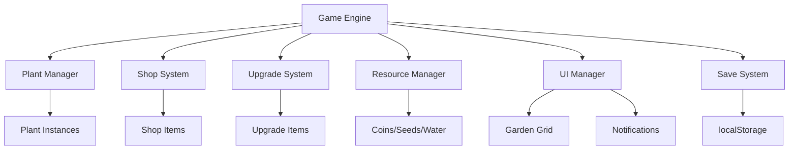

# Design Document - Idle Garden

## Overview

Idle Garden is a browser-based incremental game built with vanilla JavaScript, HTML5, and CSS3. The architecture follows a modular design with separate classes for plants, shop management, upgrades, and the main game engine. The game uses localStorage for persistence and implements a real-time update loop for continuous plant growth and income generation.

The core gameplay loop involves: planting crops → waiting for growth → earning coins → purchasing better plants/upgrades → expanding the garden. The system is designed to run continuously with minimal user interaction, providing satisfying progression through exponential growth mechanics.

## Architecture



## Components and Interfaces

### Plant Class
- Manages individual plant lifecycle (growth, income generation)
- Tracks growth progress, level, and earnings
- Handles serialization for save/load functionality

### Shop System
- Manages available plant types and their costs
- Handles purchase validation and resource deduction
- Updates UI affordability indicators

### Upgrade System
- Manages permanent improvements (growth speed, income multipliers)
- Applies effects to existing and future plants
- Tracks upgrade levels and costs

### Game Engine
- Coordinates all systems and manages game loop
- Handles time-based updates and income calculation
- Manages auto-save functionality

### Resource Manager
- Tracks coins, seeds, and water
- Handles resource transactions and validation
- Provides resource change animations

## Data Models

### Plant Data Structure
```javascript
{
  type: string,           // Plant type identifier
  level: number,          // Upgrade level
  planted: boolean,       // Whether plant is active
  growthProgress: number, // Progress toward next harvest (0-1)
  lastUpdate: timestamp,  // Last update time for offline calculation
  totalEarned: number     // Lifetime earnings from this plant
}
```

### Game State Structure
```javascript
{
  resources: {
    coins: number,
    seeds: number,
    water: number
  },
  plants: Plant[],        // Array of plant instances
  upgrades: {
    growthSpeed: number,  // Growth speed multiplier
    incomeBoost: number,  // Income multiplier
    waterEfficiency: number, // Water cost reduction
    seedProduction: number   // Seed generation rate
  },
  settings: {
    soundEnabled: boolean,
    lastSave: timestamp
  }
}
```

## Correctness Properties

*A property is a characteristic or behavior that should hold true across all valid executions of a system-essentially, a formal statement about what the system should do. Properties serve as the bridge between human-readable specifications and machine-verifiable correctness guarantees.*
Property 1: Plant placement resource deduction
*For any* plant type and resource state, when a plant is successfully planted, the player's resources should be reduced by exactly the plant's cost
**Validates: Requirements 1.3, 3.4**

Property 2: Resource sufficiency validation
*For any* plant type and resource state, planting should be allowed if and only if the player has sufficient resources for that plant's cost
**Validates: Requirements 1.2, 1.5**

Property 3: Growth cycle income generation
*For any* plant that completes its growth cycle, the player's coin balance should increase by exactly the plant's income amount
**Validates: Requirements 2.1**

Property 4: Growth cycle continuity
*For any* plant that finishes growing, the growth cycle should immediately restart without gaps or delays
**Validates: Requirements 2.3**

Property 5: Income calculation accuracy
*For any* set of active plants, the displayed total income per second should equal the sum of individual plant income rates
**Validates: Requirements 4.3**

Property 6: Plant count accuracy
*For any* garden state, the displayed total plant count should equal the actual number of planted crops
**Validates: Requirements 4.4**

Property 7: Upgrade effect application
*For any* upgrade that affects plant performance, purchasing the upgrade should immediately apply the improvement to all applicable plants
**Validates: Requirements 5.2**

Property 8: Growth speed upgrade consistency
*For any* growth speed upgrade, all current and future plants should have their growth times reduced by the upgrade multiplier
**Validates: Requirements 5.3**

Property 9: Income upgrade consistency
*For any* income upgrade, all plants should have their coin generation increased by the upgrade multiplier immediately
**Validates: Requirements 5.4**

Property 10: Save/load state preservation
*For any* game state, saving and then loading should restore all plants, resources, and upgrades to their exact previous values
**Validates: Requirements 6.3**

Property 11: Offline progress calculation
*For any* saved game with elapsed offline time, loading should award coins equal to the total income that would have been generated during that time
**Validates: Requirements 6.4**

Property 12: Affordability display accuracy
*For any* shop item and resource state, the item should be marked as affordable if and only if the player has sufficient resources
**Validates: Requirements 3.2, 3.3**

Property 13: Resource display completeness
*For any* game state, the resource display should show current values for all resource types (coins, seeds, water)
**Validates: Requirements 4.1**

Property 14: Shop information completeness
*For any* plant type in the shop, the display should include name, icon, cost breakdown, and income per growth cycle
**Validates: Requirements 3.5**

Property 15: Reset state clearing
*For any* game state, performing a reset should return all game elements to their initial values and clear saved data
**Validates: Requirements 8.1, 8.2**

## Error Handling

### Resource Validation
- All purchase attempts validate resource availability before execution
- Insufficient resource errors display clear messages to the player
- Resource calculations prevent negative values through validation

### Save/Load Operations
- Save failures are caught and reported to the player
- Corrupted save data triggers fallback to default game state
- Auto-save errors don't interrupt gameplay but notify the player

### Plant Management
- Invalid plant types are rejected with error notifications
- Growth calculations handle edge cases (negative time, overflow)
- Plant state corruption triggers automatic cleanup and replacement

### UI Error Recovery
- Missing DOM elements are recreated automatically
- Animation failures don't block game functionality
- Responsive layout adapts to various screen sizes gracefully

## Testing Strategy

### Unit Testing Approach
The game will use Jest for unit testing with focus on:
- Individual plant growth and income calculations
- Resource management operations (add, subtract, validate)
- Shop purchase logic and affordability checks
- Upgrade application and effect calculations
- Save/load serialization accuracy

### Property-Based Testing Approach
The game will use fast-check for property-based testing with minimum 100 iterations per property:
- Each correctness property will be implemented as a single property-based test
- Tests will generate random game states, plant configurations, and resource amounts
- Property tests will verify universal behaviors across all valid inputs
- Each property-based test will include a comment referencing the design document property

**Property-based testing requirements:**
- Use fast-check library for JavaScript property-based testing
- Configure each test to run minimum 100 iterations
- Tag each test with format: '**Feature: idle-garden, Property {number}: {property_text}**'
- Generate realistic game states and plant configurations for testing
- Verify properties hold across all generated inputs

### Integration Testing
- End-to-end game flow testing (plant → grow → earn → purchase)
- Cross-system interaction validation (upgrades affecting plants)
- UI responsiveness and state synchronization testing
- Save/load cycle integrity verification

### Performance Testing
- Large garden performance with many active plants
- Memory usage monitoring for long-running sessions
- Auto-save operation timing and efficiency
- UI animation performance under load